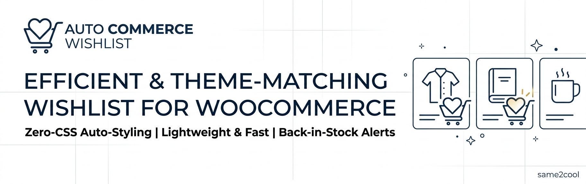
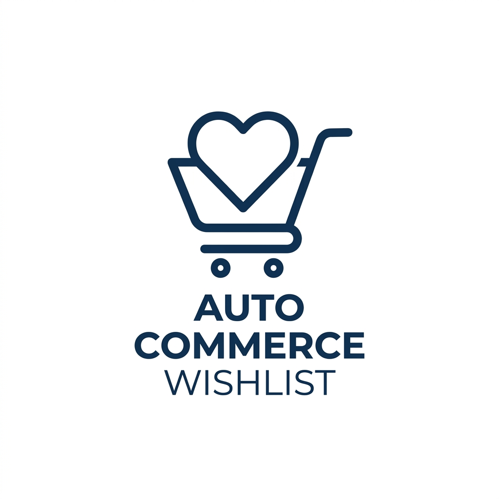

  

  

<h1 align="center">Auto Commerce Wishlist</h1>

  <strong>The zero-CSS WooCommerce wishlist plugin that instantly matches your theme — no styling, no setup, no bloat.</strong>

  
  
  
  
  
  
  

---

## 📣 Announcing Auto Commerce Wishlist

Most WooCommerce wishlist plugins hand you a button that looks like it was airlifted in from a different website — wrong font, wrong shape, wrong colors, and an afternoon of custom CSS to fix it.

**Auto Commerce Wishlist** takes the opposite approach: it looks at *your* theme and blends in automatically. The button reuses your theme's real `.button` styling, and the heart (or star, bookmark, diamond) icon is colored using your theme's own accent color — detected automatically, no configuration required.

Install it, activate it, and it just looks like it was always part of your store.

📖 **Full announcement & walkthrough:** [blog.pingbooster.site/plugins/auto-commerce-wishlist](https://blog.pingbooster.site/plugins/auto-commerce-wishlist-theme-matching-woocommerce-wishlist-plugin/)
🔌 **Download / product page:** [pingbooster.site/free-plugins/auto-commerce-wishlist](https://pingbooster.site/free-plugins/auto-commerce-wishlist/)

---

## ✨ Why store owners like it

| | |
|---|---|
| 🎨 **Zero-CSS theme matching** | Buttons inherit your theme's real styling; the icon color is auto-detected — no custom CSS ever needed. |
| ⚡ **Lightweight & fast** | No heavy front-end frameworks, no page-speed penalty. |
| 🔔 **Back-in-stock alerts** | Customers get emailed automatically the moment a wishlisted item is restocked. |
| ⏰ **Smart reminder emails** | Logged-in customers who forget an item in their wishlist for 5+ days get a one-time nudge. |
| 🔗 **Shareable wishlists** | One-click shareable link and a WhatsApp share button — perfect for gift hints. |
| 🛒 **Move All to Cart** | Adds every in-stock wishlist item to the cart and heads straight to checkout. |
| 📊 **Most Wishlisted report** | See your top 25 most-saved products, with live stock status, right in wp-admin. |
| 🧩 **Pick your icon** | Heart, Star, Bookmark, or Diamond — color always auto-matches the theme regardless of choice. |

---

## 🎨 How the theme-matching actually works

1. **Button styling** — the "Add to Wishlist" button reuses the exact same `.button` CSS class WooCommerce's own "Add to Cart" button uses, so it instantly inherits your theme's real font, padding, corner radius, and hover animation.
2. **Icon color detection** — the icon's color is auto-detected from your active theme, checked in this order:
   - Block theme.json color palette
   - Customizer `theme_mods`
   - Custom theme-options tables
   - The theme's stylesheet CSS variables
   - Falls back to a neutral gold if nothing is found
3. **Auto refresh** — the detected color is cached for 12 hours and automatically re-checked whenever you save the Customizer or switch themes, so it never goes stale.

  

---

## 📦 Installation

1. Download the plugin ZIP.
2. In WordPress: **Plugins → Add New → Upload Plugin** → choose the ZIP → **Install Now** → **Activate**.
3. On activation, a **Wishlist** page is created automatically at `/wishlist` with the `[auto_commerce_wishlist]` shortcode already in place.
4. Go to **Appearance → Menus** and add the new "Wishlist" page to your site menu.
5. Visit any product — an **"Add to Wishlist"** button now appears automatically near Add to Cart, and on shop/category listing pages.

> Requires **WooCommerce** to be installed and active. Requires WordPress 5.9+ and PHP 7.4+.

---

## ⚙️ Configuration

Head to **WooCommerce → Auto Commerce Wishlist → Icon & Display** in your dashboard to:

- Choose between **Heart, Star, Bookmark, or Diamond** icons
- Toggle whether the "Add to Wishlist" text label shows next to the icon
- Control product-page and archive-page placement
- Set which page holds the `[auto_commerce_wishlist]` shortcode

The icon color always auto-matches your active theme, no matter which icon you pick.

### Shortcodes

| Shortcode | What it does |
|---|---|
| `[auto_commerce_wishlist]` | Renders the full wishlist page |
| `[auto_commerce_wishlist_count]` | Renders a wishlist counter badge anywhere you place it |

---

## 🧰 Feature details

- **Guest + logged-in support** — guests get a 30-day cookie-based wishlist; logged-in customers get it saved to their account. Guest wishlists are merged automatically on login.
- **Wishlist counter badge** — appears automatically next to any menu item linking to the Wishlist page.
- **Share Wishlist** — customers can copy a read-only link to their wishlist to share with anyone (great for gift-giving).
- **Share on WhatsApp** — one click opens WhatsApp with the wishlist link pre-filled into a message.
- **Move All to Cart** — adds every in-stock, purchasable wishlist item to the cart and redirects to checkout.
- **Reminder emails** — a one-time reminder after 5+ days (configurable via `REMINDER_DAYS` in `includes/class-notifications.php`); guests aren't emailed since they have no account.
- **Back-in-stock emails** — sent once per restock event to any logged-in customer who wishlisted that product.
- **Most Wishlisted report** — under **WooCommerce → Most Wishlisted**, showing the top 25 most-saved products with current stock status, refreshed every 6 hours.

---

## 🖼️ Screenshots

  

*(Add product-page and wishlist-page screenshots here as you capture them — drop the images into the repo root and reference them the same way as above.)*

---

## ❓ FAQ

**Does this work with any WordPress theme?**
Yes — button styling and icon color are both detected automatically at runtime, so it adapts to block themes and classic themes alike.

**Will guests lose their wishlist if they don't have an account?**
No — guest wishlists persist via a 30-day cookie, and are merged into their account automatically if they log in later.

**Can I change the reminder email timing?**
Yes, edit the `REMINDER_DAYS` constant in `includes/class-notifications.php`.

**Is WooCommerce required?**
Yes. The plugin checks for WooCommerce on load and shows an admin notice if it isn't active.

---

## 📝 Changelog

**1.2.2**
- Removed an unavailable Plugin URI from the plugin header.
- Escaped generated product image and price HTML.
- Updated the contributor username.

**1.2.1**
- Updated the tested WordPress version to 7.1.

**1.2.0**
- Renamed the plugin to Auto Commerce Wishlist.
- Updated the plugin slug and text domain to `auto-commerce-wishlist`.
- Kept all administration pages together under WooCommerce.

---

## 📄 License

GPLv2 or later — see [gnu.org/licenses/gpl-2.0.html](https://www.gnu.org/licenses/gpl-2.0.html).

---

  Made by <a href="https://pingbooster.site/">PingBooster</a> ·
  <a href="https://pingbooster.site/free-plugins/auto-commerce-wishlist/">Product Page</a> ·
  <a href="https://blog.pingbooster.site/plugins/auto-commerce-wishlist-theme-matching-woocommerce-wishlist-plugin/">Announcement</a>

